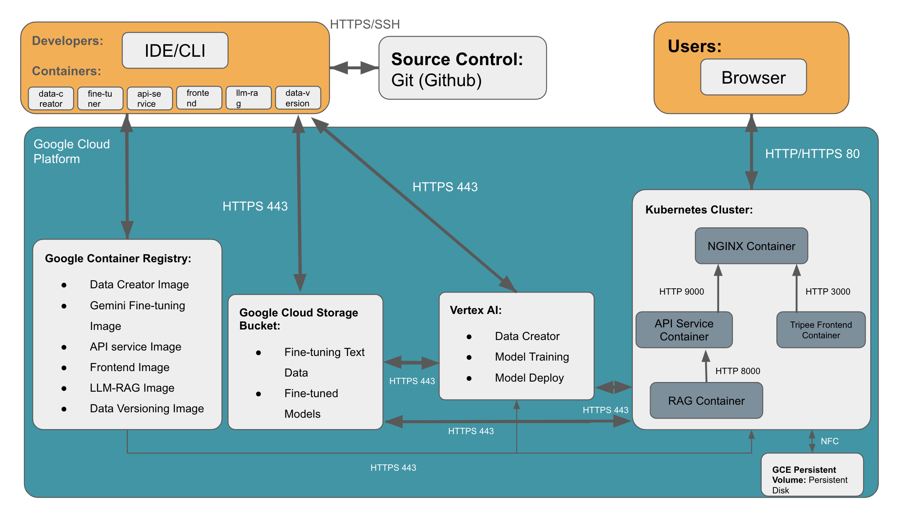

#### Project Tripee Milestone 4 Organization

***Milestone 4 Updates:***

***1. We added API-service to control the data flow of the backend and made modifications to the frontend so that it is connected to the backend in a functional way. Additionally, we integrated pytest and continuous integration into our codebase. We also use formatter to keep code clean and formatted.***

***2. For testing, we specifically tested the API-service, frontend, and RAG backend, focusing on components that do not require Google Cloud Platform authentication. The test coverage is close to 100/100.***

- To run test for api-service locally: `cd src/api-service`, `sh test-shell.sh`.
- To run test for frontend locally: `cd src/frontend`, `sh test-shell.sh`.
- To run test for llm-rag locally: `cd src/llm-rag`, `sh test-shell.sh`.
- We have linter and test incoporated as part of Continuous Integration. To see test html result, go to action (https://github.com/hiyuantang/AC215_3H2B/actions), you can choose from `Build, Lint, and Test API Service`, `Build, Lint, and Test frontend`, `Build, Lint, and Test LLM-RAG Service` on the left side bar. Once you are in one of the workflow, click on latest workflow run, you can download the `coverage-report-html` at the page bottom. 

Here is a snapeshot of test coverage for API Service: 


***3. All Docker containers, except frontend, are now running on Python 3.10 for development environment consistency. For llm-rag, we remove the agent related functions that we did not use in the project.***

***4. Notes on Continuous Integration***

Our GitHub Action workflow automates the process of building, linting, testing, and uploading test coverage reports for API service, frontend, and RAG backend. It runs on main and milestone4 branches and performs steps including building Docker images, running linting checks, executing tests with coverage, and uploading the HTML test coverage report as an artifact.

Here is a snapshot of we pass the workflow runs: 


***5. How to run Tripee:***

- Step 1: Setup GCP account and secret: put your account json secret key in `secrets` directory and rename it `llm-service-account-key.json`. Assign your account `Storage Admin` and `Vertex AI Admin`. 
- Step 2: Build and Run RAG Backend: `cd src/llm-rag`, `sh docker-shell.sh`. 
- Step 3: Build and Run api-service: `cd src/api-service`, `sh docker-shell.sh`. Inside api-server container: `uvicorn_server`
- Step 4: Build and Run Frontend: `cd src/frontend`, `sh docker-shell.sh`. 
- Note: For the API service, ensure that you have deployed the fine-tuned strict-format Gemini to the endpoint. Additionally, replace the endpoint ID in the `src/api-service/api/utils/llm_utils.py` file's MODEL_ENDPOINT variable. For the RAG backend setup, make sure you have performed a recursive split.
- Once Tripee is running, you can access the API backend service in browser: `http://localhost:9000/docs`
- Also, you can interate with Tripee via frontend UI: `http://localhost:3000`

***6. Other Modifications:***

- After careful consideration, we decided to move the route optimization component into the api-service for more convenient implementation. The reasoning is that our naive route optimization does not involve complex computations, so embedding it directly within the api-service expedites response times compared to hosting it as a standalone container, like the RAG backend, which would require additional container I/O. However, if the route optimization were to become more complex in the future, it would be more reasonable to invest extra time in developing it as a standalone microservice.

***7. Application Design***

Before we start implementing the app we built a detailed design document outlining the application’s architecture. We built a Solution Architecture and Technical Architecture to ensure all our components work together.

Here is our Solution Architecture:


***8. Technical Architecture***

Here is our Technical Architecture:



***9. Backend API***

We built backend api service using fast API to expose model functionality to the frontend. We also added apis that will help the frontend display some key information about the model and data.


***10. Frontend UI:***

***Enter required information in the Tripee Homepage:***


***Hit Plan My Trip. You will get a custom travel itinerary with Google Map visualization in 5-10 seconds***


***11. Backend Tests***

The test suite employs pytest fixtures and mocking to validate python script. The tests cover the following components:

LLM RAG Test:
- Core Embedding Logic: Validates embedding generation, city mapping, and ChromaDB collection management with proper metadata structures.
- Text Chunking: Tests multiple splitting methods (char-split, recursive-split, semantic-split) to ensure proper content segmentation and metadata preservation.
- Embedding Generation Pipeline: Validates the process of converting chunks into proper embeddings, with appropriate batch processing and file I/O handling.
- ChromaDB Integration: Validates collection management including creation, deletion, and data loading, while handling various edge cases and maintaining data integrity.
- Query Processing: Validates semantic search capabilities across different splitting methods, including metadata filtering and lexical search, ensuring proper result structure and dimensionality.
- Chat Functionality: Validates end-to-end conversation flow, from query embedding to response generation, with proper document retrieval and prompt construction across different splitting methods.
Each component uses extensive mocking to isolate functionality and verify correct behavior under various scenarios.

API Service Test:

- The API service test focuses on scripts and functions that do not involve GCP credential verification, meaning that some parts of the scripts are not tested. This is because the demo is written in a way that, upon importing the script, it immediately prompts for GCP credential verification. To bypass this verification process, we would risk introducing a significant number of errors due to modifications to the logical structure of the codebase. That said, unit tests are conducted, while integration and system tests are compromised.


***12. Frontend Tests***
The test suite utilizes Jest and React Testing Library to validate the core functionalities. The tests encompass the following components:

- Home Page Rendering: Verifies that the main heading and description are correctly displayed
- Form Inputs and Validation: Tests the presence and functionality of form inputs for "City," "Type of Trip," "Start date," and "End date." Ensures that the form does not submit and navigate to the results page when required fields are missing
- Navigation Workflow: Confirms that submitting the form with all required fields correctly navigates the user to the results page with appropriate query parameters reflecting the user's input
- Results Page Data Fetching: Validates that the results page successfully fetches and displays trip details including the itinerary and location information
- Map Integration and Rendering: Checks that the map component renders correctly with markers and polylines after data fetching. This verifies the integration with the Google Maps API and the visual representation of the trip itinerary.

## Structure
```
├── Readme.md
├── data
├── notebooks
│   └── CityWikiScraper.ipynb
├── references
├── reports
│   ├── Application Mockup Design.pdf
│   ├── Experiments.pdf
│   └── Statement of Work.pdf
├── secrets
└── src
    ├── data-versioning
    │   ├── Dockerfile
    │   ├── Pipfile
    │   ├── Pipfile.lock
    │   ├── docker-entrypoint.sh
    │   └── docker-shell.sh
    ├── dataset-creator
    │   ├── data
    │   │   └── *.dvc
    │   ├── Dockerfile
    │   ├── Pipfile
    │   ├── Pipfile.lock
    │   ├── cli.py
    │   ├── docker-entrypoint.sh
    │   └── docker-shell.sh
    ├── gemini-finetuner
    │   ├── Dockerfile
    │   ├── Pipfile
    │   ├── Pipfile.lock
    │   ├── cli.py
    │   ├── docker-entrypoint.sh
    │   └── docker-shell.sh
    ├── llm-rag
    │   ├── input-datasets
    │   │   └── cities-wiki
    │   │       └── *.txt
    │   ├── Dockerfile
    │   ├── Pipfile
    │   ├── Pipfile.lock
    │   ├── agent_tools.py
    │   ├── cli.py
    │	├── tests
    │   │   └── *
    │   ├── docker-compose.yml
    │   ├── docker-entrypoint.sh
    │   ├── docker-shell.sh
    │   └── semantic_splitter.py
    ├── route-optimization
    │   ├── cli.py
    │   ├── docker-entrypoint.sh
    │   ├── docker-shell.sh
    │   ├── Dockerfile
    │   ├── Pipfile
    │   └── Pipfile.lock
    ├── frontend
    │   ├── src/app
    │   │   └── *
    │   ├── tests
    │   │   └── *
    │   ├── .dockerignore
    │   ├── .eslintrc.json
    │   ├── .gitignore
    │   ├── docker-shell.sh
    │   ├── Dockerfile
    │   ├── jest.config.js
    │   ├── jest.setup.js
    │   ├── next.config.mjs
    │   ├── package-lock.json
    │   ├── package.json
    │   ├── postcss.config.mjs
    │   ├── README.md
    │   ├── tailwind.config.ts
    │   └── tsconfig.json
    ├── .env
    ├── docker-compose.yml
    ├── docker-shell.sh
    └── env.dev

```

### AC215 - Tripee: LLM-powered Trip Planner App ###

**Team Members**

Yuan Tang, Brian Sutioso, Jiho Kil, Wenyu Yang

**Group Name**

3H2B

**Project**

In this project, we’re developing an LLM-powered travel planner application. The app will take user inputs, such as their travel destination (city), duration, dates or months, and type of trip. The LLM will then generate a carefully tailored and considerate travel itinerary based on these inputs. Additionally, a Google map will display the locations and routes for each day of the trip, providing users with visual reference. We’ll be using techniques like fine-tuning, RAG, and chain of thoughts to enhance the quality and consistency of the output. 

## Introduction to Datasets ##

***Strict Format Dataset***

We generated a dataset of 500 pairs of question and answer pairs for fine-tuning the `Gemini 1.5 flash 002` model to behave in a way that facilitates us extracting days, themes, and location information. Specifically, the days and location information will go through a native route optimization to reduce the total distance for each day of the trip. With that in mind, the question and answer pair is formated in a way that the question will ask for a concise thematic travel itinerary and the answer will provide the itinerary in a strict format. For example:

```
- Example Pair 1:

	* Question:
      Location: Lisbon, Days: 3, Month: September, Type: Losing Friends. This is the first stage of creating an itinerary. As a professional travel planner, can you create a concise itinerary using the TDLN format? TDLN includes only the theme, days, and location names, each on a new line. The format requires that no '()' be used to explain the location, and no additional information should be provided unless specified in the prompt.

	* Answer: 
      3-Day Losing Friends Itinerary in Lisbon for September
      Day 1:  Nostalgic Walks and City Reflections
      -  Belém Tower
      -  Jerónimos Monastery
      -  Alfama District
      -  Miradouro de Santa Luzia
      Day 2:  Historical Echoes and Seeking Comfort
      -  Castelo de São Jorge
      -  Lisbon Cathedral
      -  National Tile Museum
      -  Fado Show
      Day 3:  Coastal Tranquility and Personal Growth
      -  Praia da Adraga
      -  Cabo da Roca
      -  Cascais
```

```
- Example Pair 2:

	* Question: 
      Location: Venice, Days: 2, Month: February, Type: Luxury. This is the first stage of creating an itinerary. As a professional travel planner, can you create a concise itinerary using the TDLN format? TDLN includes only the theme, days, and location names, each on a new line. The format requires that no '()' be used to explain the location, and no additional information should be provided unless specified in the prompt.

	* Answer: 
      2-Day Luxury Itinerary in Venice for February
      Day 1: Gondola Ride and Artistic Splendor
      - Doge's Palace
      - St. Mark's Basilica
      - Rialto Bridge
      Day 2: Exquisite Dining and Artistic Immersion
      - Peggy Guggenheim Collection
      - Harry's Bar
      - La Fenice Opera House
```

The goal for fine-tuning the LLM on this dataset is to make the model respond by following a strict format of a travel itinerary. The format is as follows:

```
A sentence summarizing the travel
Day 1: Theme 1
-Location 1.1
-Location 1.2
-Location 1.*
Day 2: Theme 2
-Location 2.1
-Location 2.2
-Location 2.*
...
```

The dataset, approximately 400KB in size, is generated by `Gemini 1.5 flash 002` model. We have stored it in a private Google Cloud Bucket, and we applied data version control over the dataset. 

**City Dataset**

We scraped data from the Wikipedia pages of 51 cities around the world, most of which are either capital cities or well-known tourist destinations. These pages provide detailed information about each city’s key features, including its history, economy, transportation, education, and culture. For each city, we scraped the entire Wikipedia entry, performed initial data cleaning, and converted the content into a text file for use in a Retrieval-Augmented Generation (RAG) document application. In summary, we have created a RAG dataset where each of the 51 text files contains comprehensive information on a specific city, based on its Wikipedia page.

Contents:
- `CityWikiScraper.ipynb`: A Jupyter notebook containing the scraper code.
- `Amsterdam.txt`, `Athens.txt`, `Bangkok.txt`, etc.: Text files containing the scraped data for cities like Amsterdam, Athens, and Bangkok, respectively.

The scraper starts by targeting the Wikipedia pages of the specified cities. It parses the page content to extract and organize the city information, saving the data into separate text files for each city. The scraping criteria include sections such as History, Geography, Demographics, Economy, and Points of Interest. Each text file contains structured data under labeled sections corresponding to these categories, facilitating easy reading, further processing, and analysis.

## Containers ##

We offer two options for building and running containers:
- Build and run all containers at once. __(recommended)__
- Build and run a single container or a set of containers that perform a single function.

To get started, you need to modify two files under the `./src` directory: `.env` and `env.dev`
- `.env` is responsible for providing environmental variables to `docker-compose.yml`
- `env.dev` will be read by `docker-shell.sh`
- Make sure you have updated items such as `GCP_PROJECT`, `GCS_BUCKET_NAME`, `GCP_SERVICE_ACCOUNT`, etc., according to your GCP setup.

Additionally, ensure you have your GCP key placed in the `./secrets` directory and rename it to `llm-service-account-key.json`.

## Option1: Build & Run All Containers At Once (Recommended) ##

Steps are as follows:<br />
1. Navigate to the `./src` directory:<br />
`cd src`<br />
2. Build all container images:<br />
`chmod +x ./*.sh`<br />
`./docker-shell.sh`<br />
3. Run all containers:<br />
`docker-compose up`<br />
4. Open a new terminal. View the running containers:<br />
`docker ps` or `docker ps --all`<br />
5. Now, you can attach to any container:<br />
`docker attach <container_name>`

Make sure to replace `<container_name>` with the actual name of the container you wish to attach to. You will have following container names to choose from:

`data-versioning`<br />
`dataset-creator`<br />
`gemini-finetuner`<br />
`llm-rag-cli`

## Option2: Build & Run a Single Container or a Set of Containers Performing a Single Function ##

1. Navigate to either `data-versioning`, `dataset-creator`, `gemini-finetuner`, or `llm-rag` directory:<br />
   For example: `cd ./src/data-versioning`
2. Make sure you have the permission to run the file:
   `chmod +x *.sh`
3. To build the docker image and run the container:<br />
   `./docker-shell.sh`

**Data Versioning Container**

The container is responsible for versioning the Strict Format Dataset. It will containerize and bind mount the entire Git repository. This approach is chosen because DVC (Data Version Control) works best with Git, which typically requires the inclusion of the `.git` directory in the container or bind-mounted for DVC to function properly.

1. To initialize DVC (Since our repository already has DVC initialized and contains a `.dvc` directory at the root, we do not need to perform this step again):<br />
  `dvc init`
2. Create a GCS bucket
3. In the GCS bucket, create a folder named `dvc_store`
4. To add remotes:<br />
   `dvc remote add llm_strict_format_dataset gs://<your_gcs_bucket_name>/dvc_store` for Strict Format Dataset
5. To version the datasets (This step is usually done after you create a new version of dataset using `dataset-creator` container):<br />
   `dvc add src/dataset-creator/data/*.jsonl`<br />
   `dvc add src/dataset-creator/data/*.csv`<br />
   `git add .`<br />
   `git commit -m <message>`<br />
   ***`git tag -a <tag name> -m <tag message>`***<br />
   `dvc push -r llm_strict_format_dataset`

Make sure to replace `<message>` with the actual git commit message.

**Data Creator Container**

The container generates the 500 question & answer pairs dataset, `Strict Format Dataset`, by providing appropriate instruction to prompt `Gemini 1.5 flash 002` model to produce pairs in `json` format `*.txt` files. Then, these `*.txt` files will be converted to `*.csv` and `*.jsonl` file and split into train and test sets for finetuning training and validation purpose. Both `*.csv` and `*.jsonl` files will be uploaded to GCS bucket. 

1. To generate question & answer pairs and save the data in *.txt files:<br />
   `python cli.py --generate`
2. To save data generation prompt in save it as `sys-instruct.csv`:<br />
   `python cli.py --save_prompt`
4. To prepare data for the Gemini Model, which will split the data into train and test sets and save it in `.csv` and `.jsonl` formats:<br />
   `python cli.py --prepare`
5. To upload the dataset to the GCS bucket:<br />
   `python cli.py --upload`
6. Once we generate a new version of the Strict Format Dataset, the next step is to use the Data Versioning container for version control:<br />
   `dvc add src/dataset-creator/data/*.jsonl`<br />
   `dvc add src/dataset-creator/data/*.csv`<br />
   `git add .`<br />
   `git commit -m <message>`<br />
   ***`git tag -a <tag name> -m <tag message>`***<br />
   `dvc push -r llm_strict_format_dataset`

**Gemini Finetuner Container**

The container use the `Strict Format Dataset` from the GCS bucket, which contains 500 question & answer pairs, to fine-tune a `Gemini 1.5 flash 002` model. 

1. To finetune the model:<br />
   `python cli.py --train`
2. Find the `project ID` and model `endpoint ID` and replace them in the `MODEL_ENDPOINT` variable in the `chat()` function.
3. To chat with the finetuned model:<br />
   `python cli.py --chat`
4. To delete the finetuned model (optional), you need to find the `model address` in GCP Vertex AI and replace it with the `model_name` argument in `delete_model()`:<br />
   `python cli.py --delete_model`
5. To delete the tuning job (optional), you need to find the `tuning job ID` in GCP Vertex AI and replace both the `project` and `hyperparameter_tuning_job` arguments in `delete_hyperparameter_tuning_job()`:<br />
   `python cli.py --delete_hyperparameter_tuning_job`

Specifically, the configuration we use for finetuning is: `epochs=6` `adapter_size=4` `learning_rate_multiplier=1.0`. 

**RAG & Chromadb Containers**

The container applies RAG (Retrieval Augmented Generation) to a `Gemini 1.5 flash 002` model to enhance its base knowledge regarding the travel destination city.
- In the `src/llm-rag/input-datasets/cities-wiki` directory, we have 50 cities' Wikipedia pages scraped online.
- `cli.py` in the container will feature functions such as chunking, embedding, chat, agent, etc.
- The RAG container depends on the ChromaDB container to host the chunked and embedded knowledge base.

1. To chunk the database:<br />
   `python cli.py --chunk --chunk_type char-split`<br />
   This will read each `.txt` file in the `input-datasets/cities-wiki` directory, split the text into chunks, and save the chunks as `JSONL` files in the `outputs` directory.
2. To generate embeddings for the text chunks:<br />
   `python cli.py --embed --chunk_type char-split`<br />
   We use the `text-embedding-004` model to generate the embeddings.
3. Load the chunks and embeddings into ChromaDB:<br />
   `python cli.py --load --chunk_type char-split`<br />
   You can use [ChromaDB](https://ac215-llm-rag.dlops.io/chromaui) to view this Vector Database.
4. Test querying the vector database:<br />
   `python cli.py --query --chunk_type char-split`<br />
   This will generate embeddings for the query, compare, search, and print out the top similar chunks from ChromaDB.
5. Chat with the LLM using the RAG system:<br />
   `python cli.py --chat --chunk_type char-split`<br />
   This will perform step 4, and in addition to that, it will send both the query and relevant chunks to the LLM, and print out the LLM response. You can use [Chat](https://ac215-llm-rag.dlops.io/chat) to test out LLM with the RAG system. 
6. Travel Expert Agent:<br />
   `python cli.py --agent --chunk_type char-split`<br />
   This will take the user's question and pass it to the LLM to determine the user's intent, perform function calling to get all the responses required to answer the question, pass the query and context to the LLM, and display the LLM's response.

Note: The `--chunk_type` is not limited to `char-split`; we can also use `recursive-split` or `semantic-split`.

## Extra Works ##

**Route Optimizer Container**

The container accepts a list of location names, retrieves their coordinates using the Geopy API, and calculates the optimal route between them using a greedy nearest-neighbor algorithm. The first location is randomly selected and the remaining locations are ordered by the shortest distance from the previous stop.

- To get the latitude and longitude of the locations and optimize the route: `python cli.py "Location1" "Location2" "Location3" ...`
- The CLI outputs the optimal order of locations starting from a random point and following the shortest path to the next location.

**Trip Advisor frontend Container**

This frontend allows users to input trip details, including destination city, type of trip, and travel dates. Once submitted, the user is redirected to a page that displays a map with trip suggestions based on the model. The map shows optimized routes between locations, and users can view details such as travel times, locations, reasons for each stop, and travel tips.

- To select travel preferences and submit the form, users can interact with dropdowns and date pickers in the UI.
- The map visualizes the generated trip itinerary, showing location routes and travel recommendations.

----

**Notebooks/Reports**

This folder contains code and pdf that is not part of container 

- `CityWikiScraper.ipynb`: This Python notebook helps scrape city data from Wikipedia.
- `Application Mockup Design.pdf`: Contains the visualizations of UI and wireframes.
- `Experiments.pdf`: Visualizes and explains the experiments we ran for RAG, fine-tuning, running instances, DVC, etc.
- `Statement of Work.pdf`: Contains the updated statement of work.

----
